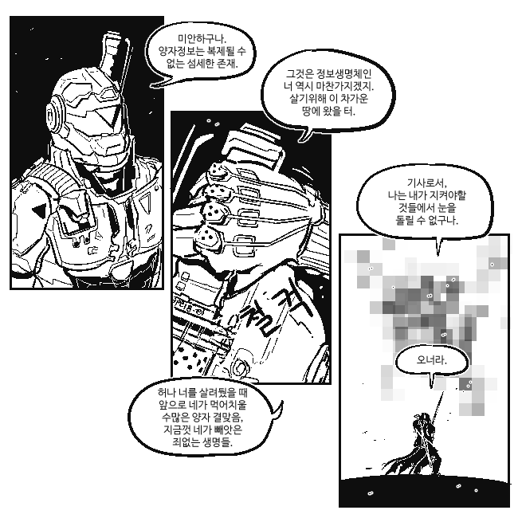

정보처리기사
==========

# 0. 목적
숙원사업 정보처리기사 자격증 취득을 위해 관련 내용들을 메모하도록 하자.  

  
*ㄱㄱㅈ...*

# 1. 필기

* 데이터베이스
* 전자 계산기 구조
* 운영체제
* 소프트웨어 공학
* 데이터 통신

1 과목 당 20 문항, 총 5과목.  

과목 전체 평균 60점 이상, 한 과목도 40점 이하로 떨어지지 않으면 **합격**.

문제 은행 방식으로, 기출문제 계속 풀면 합격은 한다고 함.

2020년 부터 시험 내용이 바뀌므로 어떻게든 올해 안에 합격하도록 하자.

[시험 준비는 여기서(기출문제)](https://www.comcbt.com/xe/gscomcbt)  

[개념적인 부분은 이 사이트가 가장 좋은듯](http://ehpub.co.kr/)

## 1. [데이터베이스](./필기_1데이터베이스.md)

## 2. [전자 계산기 구조](./필기_2전자계산기구조.md)

## 3. [운영체제](./필기_3운영체제.md)

## 4. [소프트웨어 공학](./필기_4소프트웨어공학.md)

## 5. [데이터 통신](./필기_5데이터통신.md)

# 2. 실기
일단 필기 붙고나서 생각.