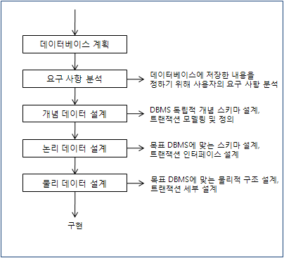
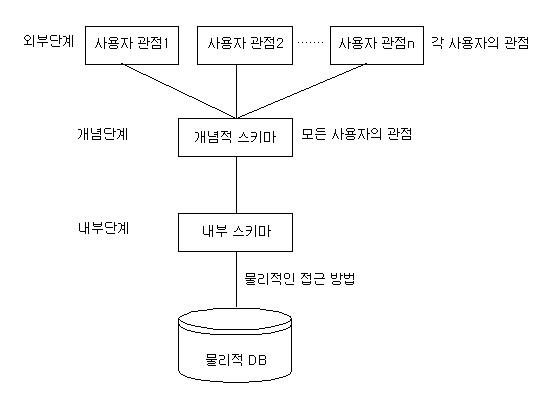
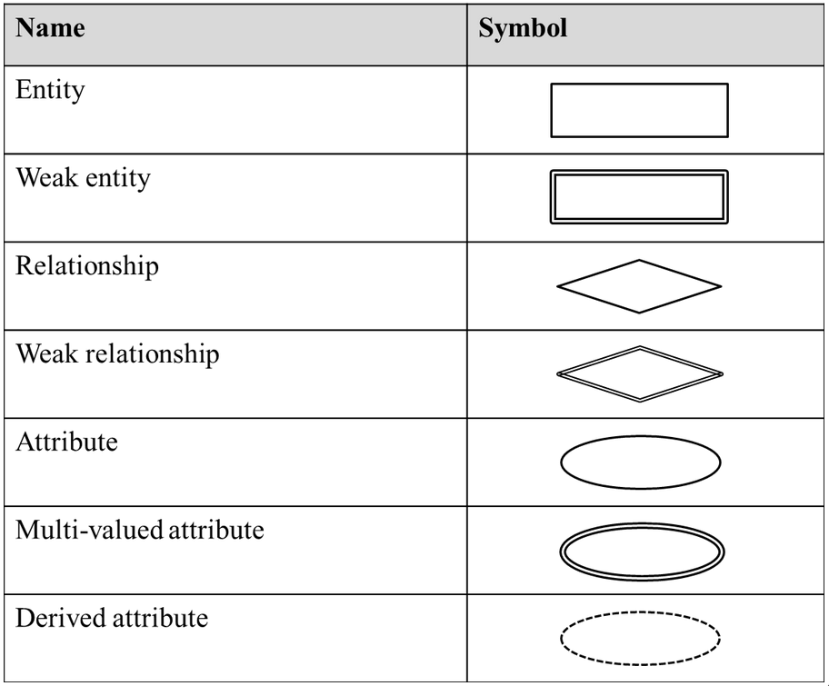
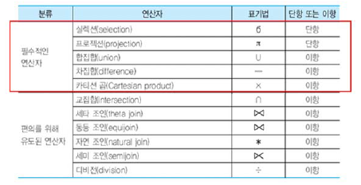
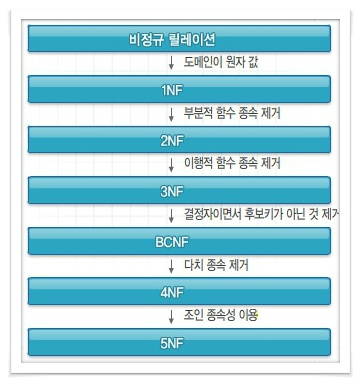
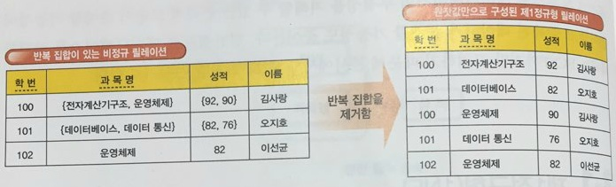
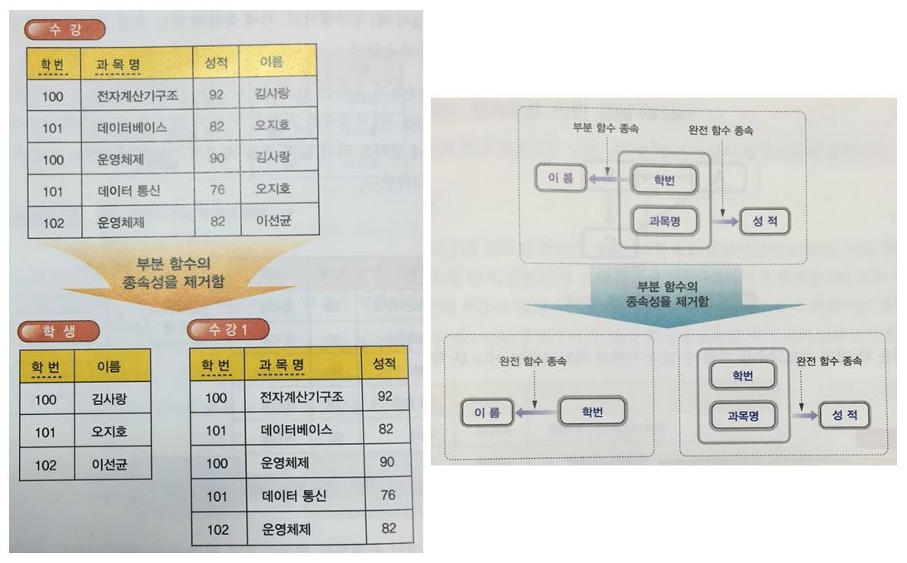
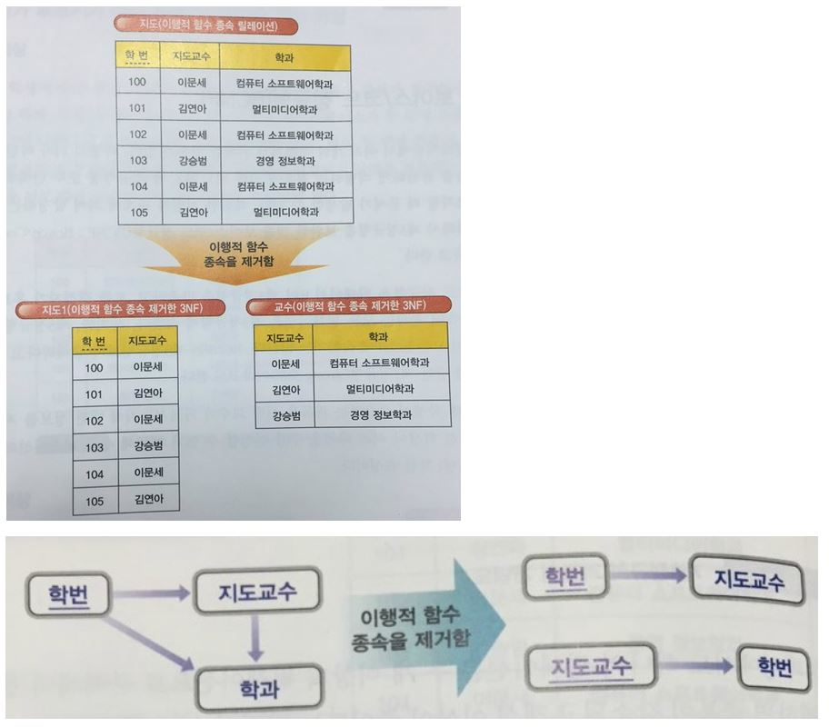
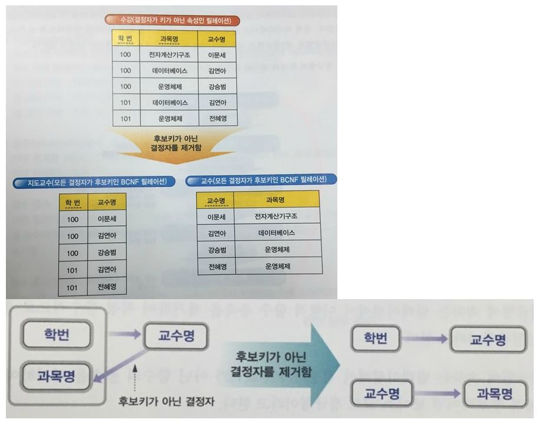

데이터베이스와 자료구조 기초.
---

### 데이터베이스 설계 순서

  

1. 요구조건 분석 / 명세

2. 개념적 설계 (E-R모델)

3. 논리적 설계 (데이터 모델링)

4. 물리적 설계 (데이터 구조화)

5. 데이터베이스 구현

---

### SQL의 종류
DML - 데이터 조작어. SELECT, INSERT, UPDATE, DELETE.  
==> 테이블에 있는 데이터를 조작하는 명령어들.

DDL - 데이터 정의어. CREATE, ALTER, DROP, RENAME, TRUNCATE.  
==> 테이블 그 자체를 정의하는데 사용하는 명령어들.

DCL - 데이터 제어어. GRANT, REVOKE.  
==> 데이터에 대한 접근을 제어하는 명령어들.

---

### 스키마
데이터 구조와 제약조건에 대한 명세를 기술하는 것. 개체, 속성, 관계에 대한 정의와 이들이 유지해야 될 제약 조건을 포함.

3계층 데이터베이스 구조  
  

외부 스키마 (External)  
개개 사용자가 보는 개인적인 데이터베이스에 관한 구조.

개념 스키마 (Conceptual)  
데이터베이스 전체적인 논리적 구조. 개체 간의 관계와 제약조건을 나타내고, 데이터베이스의 접근 권한, 보안 정책 및 무결성 규정에 관한 명세를 정의한다.

내부 스키마 (Internal)  
물리적 저장 장치의 입장에서 본 데이터베이스 구조. 데이터베이스의 물리적 구조를 정의한다.

---

### 질의어
사용자가 데이터베이스에 있는 정보를 꺼내기 위하여 쓰는 언어

관계 대수  
원하는 데이터를 얻기 위해서 어떻게 질의를 수행할 것인지 일련의 연산을 순서대로 명시해야하는 **절차적 언어**.

관계 해석  
원하는 데이터만을 명시하는 **비절차적 언어**.

---

### E-R 다이어그램
데이터베이스의 논리적 구조를 표현하기 위한 도구.

  

---

### 관계 대수
  

셀렉트 (SELECT, σ)  
릴레이션에서 주어진 조건을 만족하는 튜플을 선택하는 연산자. SQL에서 FROM ~ WHERE ... 에 해당된다고 생각하자. 
셀렉션 조건에는 비교연산자, 부울 연산자가 포함 가능.  
형식 : σ<셀렉션 조건>(릴레이션)

프로젝트 (PROJECT, π)  
릴레이션에서 어트리뷰트 리스트에 제시된 어트리뷰트만을 추출하는 연산자. SQL에서 SELECT (ATTRIBUTE) 에 해당된다. 헷갈리게...  
형식 : π<어트리뷰트>(릴레이션)

집합 연산자  
합집합, 교집합, 차집합 모두 학창시절에 배운 것들. 단항 연산자였던 위의 연산자와 달리 이항 연산자이다.  
잡합 연사자의 입력으로 사용되는 두 릴레이션은 **합병 가능**해야함.

합병 가능  
두 릴레이션 R1, R2의 1) 어트리뷰트의 수가 같고, 2) 대응되는 어트리뷰트 별로 도메인이 같아야 한다.

카티션 곱  
R x S, 차수 n+m, 카디날리티 i*j, 어트리뷰트가 (A1, ..., An, B1, ..., Bm). 즉 R과 S의 튜플들의 모든 가능한 조합으로 이루어진 릴레이션이므로 매애애애애우 큼.

**조인 (Join, ⋈)**  
공통 속성을 중심으로 두 개의 릴레이션을 하나로 합쳐서 새로운 릴레이션을 생성함.

* 세타 조인 : 카티션 곱에 조건으로 셀렉션 한 것.
* 동등 조인 : 세타 조인 중 셀렉션 조건이 **=(동등)** 인 조인.
* 자연 조인 : 동등 조인에서 조인 조건 비교에 사용된 두 릴레이션의 어트리뷰션 중 하나를 없앤 조인. 두 어트리뷰션은 애초에 같은 값이기 때문에 하나를 제외하는게 **자연**스럽다. R⋈속성S
* 외부 조인 : 왼쪽, 오른쪽, 완전 외부 조인이 있다. 간단하게 R⋈S일 때, 왼쪽 조인은 R의 튜플 중 조인에 관여하지 못하는 튜플도 일단 집어넣고 S에서 온 어트리뷰트 값에는 null을 집언허는 것. 오른쪽은 반대, 완전은 둘 다.
* 세미 조인 : 이런것도 나온다구요? 하나 틀리지 뭐!

조인 자체가 이렇게 자세하게 나오긴 하나..?

디비전 (÷)  
나누어지는 릴레이션에서 나누는 릴레이션의 모든 투플과 관련이 있는 투플을 구한다.

---

### 키 (Key)
키는 기본적으로 릴레이션을 구성하는 속성들에 대해서 사용되는 용어다.

후보 키 (Candidate Key)  
속성들 중에서 **튜플을 유일하게 식별할 수 있는 속성들의 부분집합**을 의미한다. 모든 릴레이션은 하나 이상의 후보키를 가져야한다. 유일성(하나의 키 값으로 하나의 튜플만을 유일하게 식별가능)과 최소성(키를 구성하는 속성 하나를 제거하면 유일하게 식별할 수 없도록 꼭 필요한 최소의 속성으로 구성)을 만족해야 한다.

기본 키 (Primary Key)  
후보키 중에서 선택받은 키. Null 값을 가질 수 없고, 동일한 값이 중복되어 저장될 수 없다. => **개체 무결성**

대체 키 (Alternate Key)  
나머지 선택받지 못한 후보키들. 다른 말로는 보조키.

슈퍼 키 (Super Key)  
**한 릴레이션 내에 있는 속성들의 집합으로 구성된 키**. 유일성은 만족하는데 최소성은 만족하지 못한다. 후보키보다는 넓은 구분?

외래 키 (Foreign Key)  
관계를 맺고 있는 릴레이션 R1, R2에서 릴레이션 R1이 참조하고 있는 릴레이션 R2의 기본키와 같은 R1 릴레이션의 속성. 외래키로 지정되면 **참조 테이블의 기본키에 없는 값은 입력할 수 없다**.

---

### 무결성 (Integrity)
무결성이란 데이터의 정확성, 일관성, 유효성이 유지되는 것을 말한다. 3가지 있다.

개체 무결성 (Entity Integrity)  
Null 값을 가질 수 없고, 동일한 값이 중복되어 저장될 수 없다. 모든 테이블이 기본 키로 선택된 필드를 가져야 한다.

참조 무결성 (Referential Integrity)  
외래키 값은 NULL이거나 참조 릴레이션의 기본키 값과 동일해야한다. 참조 관계에 있는 두 테이블의 데이터가 항상 일관된 값을 갖도록 유지되어야 한다.

도메인 무결성 (Domain Integrity)  
특정 속성의 값이 그 속성이 정의된 도메인에 속한 값이어야 한다. 쉽게 생각해서 날짜에 갑자기 텍스트 데이터가 들어가면 안된다.

---

### **정규화**
진짜 머리 터져나간다 정규화는.

왜 하는가??  
1. 어떤 관계라도 데이터베이스 내에서 표현이 가능하도록 만든다.
2. 관계에서 바람직하지 않은 삽입, 삭제, 갱신 이상이 발생하지 않도록 한다.
3. 새로운 형태의 데이터가 삽입될 때 관계를 재구성할 필요성을 줄인다.
4. 보다 간단한 관계 연산에 기초하여 검색을 보다 효율적으로 할 수 있다.

그냥 하면 좋대.

Anomaly  
속성 간에 존재하는 여러 종속 관계를 하나의 릴레이션에 표현함으로써 데이터의 중복이 발생. 이 중복이 야기하는 여러가지 변칙(Anomaly).
* 삭제 이상 : 연쇄삭제에 의한 정보 손실
* 삽입 이상 : 원하지 않는 정보의 강제 삽입
* 갱신 이상 : 중복 데이터의 일부 갱신으로 정보의 모순성 발생

함수 종속 (X -> Y)  
: X가 Y를 결정한다. X는 Y의 결정자다.  
: X가 결정자, Y가 종속자  
: ex) {학번, 과목번호} -> 학년

부분 함수적 종속 (PFD)
속성집합 Y가 속성집합 X의 전체가 아닌 일부분에도 함수적으로 종속됨을 의미한다.

완전 함수적 종속 (FFD)  
속성집합 Y가 속성집합 X 전체에 대해서만 함수적으로 종속된 경우를 말한다.

정규화  
  
정규화 과정을 거칠 수록 Join 연선으로 인한 성능 저하를 가져올 수 있다. 반대 개념으로는 역정규화가 있다.

제 1 정규화 (1NF)  
  
어떤 릴레이션 R에 속한 모든 도메인이 원자값(Atomic value)만으로 되어 있다.

제 2 정규화 (2NF)  
  
어떤 릴레이션 R이 제 1 정규형이고. 키에 속하지 않은 속성 모두가 키에 완전 함수 종속이어야 한다.

제 3 정규화 (3NF)  
  
어떤 릴레이션 R이 제 2 정규형이고, 모든 속성들이 기본키에 **이행적 함수 종속(A -> B, B -> C인 경우 A -> C를 뜻함) 이 아니면** 제 3 정규형에 속한다.

보이스/코드 정규형 (BCNF)  
  
어떤 릴레이션 R이 제 3 정규형이고, 모든 결정자가 후보키어야 한다.  

> R(A, B, C) 기본키 : (A, B)  
> 함수적 종속성 : {A, B} -> C, C -> B  
> 이 경우 키가 아닌 C가 결정자이므로 BCNF에 해당되지 않고 3 정규형에 해당된다.
> 릴레이션을 둘로 분해해 각각 함수적 종속성을 A -> C, C -> B로 만들어주면 된다.

제 4 정규화 (4NF)  
다치 종속을 제거

제 5 정규화 (5NF)  
조인 종속성에 의해 정규화

4, 5는 알아만 두자.

---

### 인덱스 (Index, 색인)
테이블에 저장된 데이터를 빠르게 조회하기 위한 데이터베이스 객체. 논리적/물리적으로 테이블과 독립적이다.

---

### 시스템 카탈로그
데이터베이스 관리자의 도구로, 데이터베이스에 저장되어 있는 모든 데이터 개체들에 대한 정의나 명세에 대한 정보가 수록되어 있는 시스템 테이블. 일명 데이터 사전. 들어있는 내용은 메타데이터라고 한다. 일반 사용자들도 접근 가능하다.

시스템 카탈로그의 내용  
* 릴레이션 관련 정보
* 인덱스 관련 정보
* 뷰 관련 정보
* 통계 관련 정보
* 사용자 관련 정보

---

### 선형 검색
O(n)인 그 검색 알고리즘. 그렇다고 평균 비교 횟수가 n인게 아니다. 최악의 경우 n, 최선의 경우 1이기 때문에 평균 검색 횟수는 **(n + 1)/2**  

그냥 쉽게 생각했는데 틀려버려서...

---

### 트리
이제는 이건 전산기초상식이다.

* 노드의 크기 : 자신을 포함한 모든 자손 노드의 개수
* 노드의 깊이 : 루트에서 어떤 노드에 도달하기 위해 거쳐야 하는 간선의 수
* 노드의 레벨 : 트리의 특정 깊이를 가지는 노드의 집합
* 노드의 차수 : 하위 트리 갯수 => 각 노드가 가진 가지의 수
* 트리의 차수 : 트리의 최대 차수
* 트리의 높이 : 루트 노드에서 가장 깊숙히 있는 노드의 깊이

---

### 색인 순차 파일
이건 정말 기억이 안난다. 데이터베이스 배울 때 나왔었나?

색인 순차 파일 (Indexed Sequential File | Access-Method)  
순차처리와 임의처리가 모두 가능하도록 레코드들을 키값순으로 정렬하여 저장하고, 레코드의 키만을 따로 모아 색인을 구성한 것.

* 기본 구역 (Prime Area) : 실제 레코드를 저장하는 부분. 키 값순으로 정렬됨.
* 색인 구역 (Index Area) : 기본 구역에 있는 레코드들의 색인이 저장되는 부분.
* 오버플로우 구역 (Overflow Area) : 기본 구역에 공간이 없어서 레코드 삽입이 불가능한 경우를 대비해 만든 예비공간.  

위의 세 구역으로 구성된다.  
|장점|단점|
|:-:|:-:|
|유연성|추가 저장 공간 필요|
|삽입, 삭제, 갱신이 효율적|추가, 삭제가 많아질수록 정렬로 인해 효율 저하|

데이터베이스가 아니라 다른 파트에서 나오는건가...?

---

### 정렬

O(n2) 인 것들만.

버블 정렬  
뒤에서 부터 정렬, 나머지에서 가장 앞에 있는 원소를 골라서 하나씩 비교-교환.

선택 정렬  
앞에서 부터 정렬, 나머지에서 가장 좋은것을 골라 앞으로 보냄.

삽입 정렬  
k번째 원소를 이미 정렬된 1부터 k-1 사이에 끼워넣음.

---

### 용어 정리

|일반적 개념|모델링|DB 객체|
|:-:|:-:|:-:|
|Relation|Entity set|Table|
|Row|Tuple, Entity|Record|
|Column|Atrribute|Field|

Cardinality : 튜플의 수. 번역명은... 없음. 집합의 크기.  

Degree (차수) : 속성의 수.

Domain : 한 속성에 나타날 수 있는 값들의 범위.

Atomic Value (원자값) : 더 이상 분리되지 않는 값.

데이터베이스 : 여러 사용자가 원하는 정보를 얻기 위해서 모아둔 자료의 집합. 관련 있는 데이터들의 집합.

데이터베이스 관리 시스템 (DBMS) : 데이터를 편리하게 저장하고 효율적으로 관리하고 검색할 수 있는 환경을 제공해주는 소프트웨어. 조작DML, 정의DDL, 제어DCL 가능.

Transaction (트랜잭션) : 데이터베이스의 상태를 변환시키기 위하여 논리적 기능을 수행하는 하나의 작업 단위.  