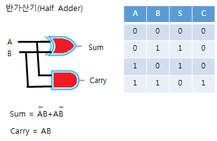
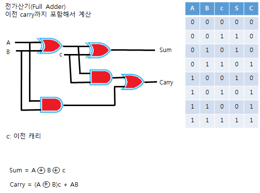

논리회로 및 컴퓨터 구조
---

전체적으로 정답률이 처참하다. 데이터베이스는 쉬웠던거 같은데...

---

### 코드

ASCII 코드  
7비트로 128개의 문자 표현. 그냥 앞에 패리티 비트 줘서 8비트(1바이트)로 표현하기도 한다. 구조는 Parity Bit(1) + Zone Bits(3) + Digit Bits(4)로 구성.

BCD(Binary Coded Decimal) 코드  
2진화 10진 코드로, 6비트로 한 문자를 표현한다. 역시 패리티 비트 추가해서 7비트로 표현할 수 있고, Parity Bit(1) + Zone Bits(2) + Digit Bits(4)로 구성된다. Digit Bits의 각 비트가 8 4 2 1의 값을 의미해서 8421 코드라고도 부른다. 여기에 Zone에 2비트 추가하면 확장 BCD 코드.

Excess-3 코드  
BCD 코드에 3을 더하면 된다. 모든 비트가 동시에 0인 경우가 없다고 하는데, 중요한 특성은 **자기 보수 코드**라는 점.

자기 보수 코드  
1의 보수를 취했을 때, 10 진수의 9의 보수를 얻을 수 있는 코드. 9의 보수는 자신과 더해서 9, 99, ... 가 나오는 수. ex) 6의 9의 보수는 3.

그레이 코드  
2진법을 표현하는 방법 중 하나. 가중치가 없는 코드라 연산에는 부적합 하다고 함. ADC나 입출력 장치 코드로 주로 쓰인다고.

특징은, **연속되는 코드들 간에 하나의 비트만 변화하여 새로운 코드가 되며**, 입력 코드로 사용하면 오차가 적어진다고 한다.

|10진 코드|2진 코드|그레이 코드|
|:-:|:-:|:-:|
|0|0000|0000|
|1|0001|0001|
|2|0010|0011|
|3|0011|0010|
|4|0100|0110|
|5|0101|0111|
|6|0110|0101|
|7|0111|0100|
|8|1000|1100|
|9|1001|1101|
|10|1010|1111|
|11|1011|1110|
|12|1100|1010|
|13|1101|1011|
|14|1110|1001|
|15|1111|1000|

노가다는 이쯤하고, 중요한 것은 일반 2진 코드를 어떻게 그레이 코드로 변환하느냐!

1. 최상위비트는 그대로 사용.
2. 그 다음 비트 부터는 앞의 2진 비트와 그 다음 2진 비트를 XOR 연산해 변환한다.

그 반대는 어떻게 하느냐?

1. 최상위비트는 그대로 사용.
2. 생성된 비트와 그레이 코드의 다음 비트를 XOR 연산해 변환한다.

---

### 플립플롭
입력과 클럭에 따라 상태가 변하는 순서 논리회로.

RS 플립플롭  
이전 클락 값을 유지하거나 0 혹은 1로 설정하는 플립플롭. S는 설정 입력 값, R은 리셋 입력 값. R은 말그대로 1 입력시 출력을 0으로, S는 입력시 출력은 1로, 둘 다 입력하지 않으면 이전 상태 유지. 11은 불가.

D 플립플롭  
D는 Delay를 의미하고, 입력이 하나다. 입력한 값을 다음 클락의 출력으로 지연하는 플립플롭이다.

JK 플립플롭  
RS 플립플롭에서 R과 S에 동시에 1을 입력하지 못하는 것을 보완한 플립플롭. 둘 다 1인 경우 현재 상태의 반대 상태를 출력한다.

T 플립플롭  
토글 플립플롭. 토글.

MS(Master-Slave) 플립플롭  
RS 플립플롭 두 개로 구성한 플립플롭으로, 마스터와 슬레이브로 나뉜다. 플립플롭에서 발생하는 경쟁(Race) 현상을 없애기 위한 플립플롭. 경쟁 현상이란, 출력값을 입력값으로 사용하는 피드백 과정에서의 불안정한 상태를 말한다.

---

### CPU(Central Processing Unit)
레지스터, 산술논리유닛(ALU), 제어장치(CU), 버스로 구성된다.

레지스터(Register)  
CPU 내에서 데이터를 기억하는 기억 장치. 명령어, 연산에 사용할 값, 연산 결과를 일시적으로 기억한다. 플립플롭과 래치를 병렬로 구성해 만든다.

* Program Counter : 다음 번에 실행할 명령어 주소를 기억하는 레지스터
* Instruction Register : 현재 실행 중인 명령을 기억하는 레지스터
* Accumlator : 연산 결과를 임시로 저장하는 레지스터 (누산기)
* Flag Register : 상태를 기억하는 레지스터 (오버플로우, 언더플로우, 캐리, 인터럽트 등의 Program status word)
* Memory Address Register : 데이터의 주소를 기억하는 레지스터
* Memory Buffer Register : 데이터를 임시로 기억하는 레지스터
* Base Register : 명령의 시작 주소를 기억하는 레지스터
* Major Status Register : CPU의 주 상태를 저장하는 레지스터
* Index Register : 프로그래머가 내용을 변경할 수 있으며 주소의 변경, 서브루틴 여결 및 반복 연산의 횟수에 사용
* Data Register : 연산에 사용할 데이터를 기억
* Shift Register : 자리 이동 레지스터  

상당히 많다.

산술논리유닛(ALU)  
산술과 논리 연산을 하는 장치. 가산기, 누산기, 보수기, 오버플로우 검출기, 시프트 레지스터, 데이터 레지스터로 구성된다.

제어장치(CU)  
장치들에게 동작을 명령하고 제어하는 장치. 명령어를 해독해서 제어신호를 전송한다. 명령어 레지스터, 제어 주소 레지스터, 제어 버퍼 레지스터, 명령 해독기(디코더), 제어신호 발생기(인코더), 제어 기억장치, 순서 제어 모듈(명령어 수행 순서 결정), 순차 카운터(타이밍 신호 생성)로 구성된다.

버스(Bus)  
장치와 장치 사이에 정보를 주고받기 위한 전송선. 주소, 자료, 제어 정보를 보내는 버스가 있다.  
CPU와 메모리 내에 구성하는 버스를 내부 버스라 부르고, 주변 입출력 장치에 구성하는 버스를 외부버스라 한다.

---

### 기억 장치

RAM(Random Access Memory)  
읽고 쓰기가 가능한 기억 장치. 현재 동작 중인 프로세스의 메모리를 기억하는 용도로 사용. 휘발성.

SRAM(Static)  
플립플롭을 사용해 방전현상이 없고 속도가 빠르고 전력소모가 많고 비싸다. 그래서 주로 캐시 메모리에 사용.

DRAM(Dynamic)  
커패시터를 사용해 주기적으로 재충전이 필요하다. 속도는 비교적 느리지만 구조가 간단해서 집적도를 높이기 좋다.

ROM(Read Only Memory)  
이름에서부터 알 수 있는 읽기 전용 기억 장치. BIOS같은 변경할 확률이 적은 시스템 소프트웨어를 기억하는 용도로 사용. RAM과 달리 비휘발성.

Mask ROM, PROM, EPROM, EAROM이 있다. 각각 다시쓰기 불가, 빈 상태, 쓰기 가능, 쓰기 가능, 일부 변경 가능.

자기 코어  
이런것도 있었네? 데이터를 읽으면 내용이 지워지는 메모리 라고 한다. DRO(Destructive Read Out) 이라고도 함.

이상 주기억장치.

보조기억장치  
주기억장치의 단점을 보완하기 위한 기억장치. 비휘발성, 저속, 대용량.

연관 메모리  
기억장치의 내용을 찾을 때 기억장치가 있는 주소로 찾아가는게 아니라 기억된 정보의 일부를 이용해 찾아가는 것. 매핑 테이블을 사용한다.

---

### 캐시 메모리
CPU의 처리 속도와 주기억 장치의 속도 차이를 줄이기 위해 사용하는 고속 메모리 버퍼. 주기억 장치에 접근하는 횟수를 줄여 전체 처리 속도를 향상시킨다.

적중률  
적중률 = 적중 횟수/총 접근 횟수

쓰기 정책  
* Write Through : 쓰기 동작을 할 때마다 캐시 메모리와 주기억 장치를 동시에 변경
* Write Back : 쓰기 동작 중에는 캐시 내용만 변경하고, 캐시에서 제거할 때 주기억 장치에 복사
* Write Once : 캐시에 한 번만 기록

매핑  
주기억 장치의 임의의 블록을 지정된 캐시 블록에 기억시키는 방법.  
* 직접 매핑 : 주기억 장치의 자료 블록을 지정한 캐시 라인에만 매핑한다.
* 연관 매핑 : 아무 캐시 라인에 매핑할 수 있다.
* 집합 연관 매핑 : 복수의 캐시라인을 묶은 집합에 매핑할 수 있다.

---

### 가상 메모리
프로그램의 메모리 주소를 실제 물리 메모리 주소가 아닌 논리 메모리 주소를 부여하는 것. 주기억 장치의 용량이 부족할 때 보조기억 장치를 빌려서 사용할 수 있도록 만들어 준다.  
가상 메모리에서의 매핑은 논리주소를 물리주소로 변환하는 것을 뜻한다.  
가상 메모리는 **같은 크기로 나눠 관리하는 페이징 기법**과 **가변 크기로 나누는 세그먼트 기법**이 있다.

스테이징  
자주 사용하는 자료는 주기억 장치에, 사용률이 낮은 자료는 보조기억 장치에 배정하는 것을 뜻한다.
* Least Recently Used - 최근 사용 횟수가 가장 적은 메모리를 페이지 파일로 매핑
* Least Frequently Used - 사용 횟수가 가장 적은 메모리를 페이지 파일로 매핑
* Not Used Recently - 최근에 사용하지 않은 메모리를 페이지 파일로 매핑
* FIFO - 먼저 적재한 페이지부터 페이지 파일로 매핑
* Most Frequently Used - 사용 횟수가 가장 많은 메모리를 페이지 파일로 매핑

세그먼트의 최대 크기  
세그먼트의 최대 크기 = 2(페이지 번호 비트 + 워드 필드 비트)

Page Fault  
CPU가 액세스한 가상 페이지가 주기억장치에 없는 경우를 뜻한다. 페이지 부재 시에는 해당 페이지를 디스크에서 주기억장치로 가져와야 한다.

---

### 명령어

|연산|주소 결정 방식|주소 필드|
|:-:|:-:|:-:|

연산 종류 (OP Code)  
수행할 연산자. 조금 더 상위 계층 기준으로 설명하자면, 함수명. 함수 연산, 자료 전달 연산, 제어 연산, 입출력 연산으로 나눌 수 있다.  
ADD, SUB, MUL, DIV, 산술 쉬프트 | AND, OR, NOT, XOR, 논리 시프트, 로테이션 시프트, Complement, Clear | Load, Store, Move, Push, Pop | GOTO, Jump, IF, SPA(양수면 Skip), SNA(음수면 Skip), SZA(0이면 Skip), CALL, Return | Input, Output

주소 결정 방식 (Mode)  
직접 모드(0), 간접 모드(1) 가 있다.

명령어 방식  
주소 필드에 올 수 있는 주소의 수에 따라 명령어 방식을 구분한다.
* 0 Address - **스택** 사용 (후위 연산, 피연산자는 상위 2개씩)
* 1 Address - **누산기** 사용
* 2 Address - 기억장치, 중앙처리장치에 수행결과가 남아있음, 프로그램 길이가 길어짐, 수행시간이 짧음
* 3 Address - 원래의 자료가 사라지지 않음, 프로그램 길이가 짧아짐, 수행시간이 길어짐

---

### Addressing Mode (주소 지정 방식)
주소 지정 방식이란 프로그램이 수행되는 동안 사용될 데이터의 위치를 지정하는 방법이다.

고려 사항  
* 표현의 효율성 - 주소 지정에 적은 비트 사용
* 사용의 편리성 - 포인터, 프로그램 리로케이션 등 편의 제공
* 주소공간과 기억공간의 독립성 - 프로그램 상에서 사용한 주소를 변경 없이 실제 기억공간 내의 주소로 재배치할 수 있도록 (주소공간 : 보조기억장치, 기억공간 : 주기억장치)

종류
* 암시적 (Implied)
* 즉시적 (Immediate)
* 직접 (Direct)
* 간접 (Indirect)
* 계산에 의한

암시적 주소지정  
주소를 지정하는 필드가 없고 0번지 명령어에서 Stack의 Stack Pointer가 가리키는 Operand를 암시적으로 이용함.

즉시적 주소지정  
명령어 자체에 오퍼랜드를 내포하고 있는 방식. 여기서 **오퍼랜드는 실제 데이터**다. 주소가 아니라. 기억장소를 액세스 하지 않고 CPU에서 곧바로 자료를 이용할 수 있어서 빠르다. 대신 명령어가 길 수록 데이터 값을 표현하기에 애로사항이 꽃핀다.

직접 주소지정  
명령의 주소부가 사용할 자료의 주소를 표현하고 있는 방식. **기억용량이 2n의 Word인 메모리 시스템에서 주소를 표현하려면 n비트의 주소부가 필요함.**

간접 주소지정  
위에서 볼드한 내용 때문에 명령어에 나타낼 주소가 명령어 내에서 데이터를 지정하기 위해 할당된 비트 수로 나타낼 수 없을 때 사용. **주소부에 사용할 데이터가 저장된 장소의 주소를 표현한다.** 즉 최소한 주기억장치를 두 번 이상 접근해야 함. 더블 포인터가 생각나는 방식.

계산에 의한 주소지정  
이게 또 세 가지로 나뉜다.
* 상대 주소 지정방식 : 명령어의 주소부분 + PC(Program Counter)
* Base Register Mode : 명령어의 주소부분 + Base Register (프로그램 재배치에 사용)
* Index Register Mode : 명령어의 주소부분 + Index Register

---

### 병렬 컴퓨터
병렬 처리란 컴퓨터 성능 향상을 위해 여러 프로세서에서 동시에 여러 작업을 처리하는 것이다.

병렬처리의 문제점
1. 분할의 문제
2. 스케줄링의 문제
3. 동기화의 문제
4. 캐시 메모리의 문제

Flynn의 4가지 분류 (Single, Multipe, Instruction, Data)  
* SISD
* SIMD 배열프로세서
* MISD
* MIMD 파이프라인

파이프라인  
하나의 프로세서를 서로 다른 기능을 가진 여러 개의 서브 프로세서로 나누어, 각 서브 프로세서가 동시에 서로 다른 데이터를 취급하는 방식. 즉 Multiple Instruction, Multiple Data

파이프라인 속도 계산  
전체 회로의 지연 시간 = 각 회로의 시간 지연 중 가장 큰 값 + 중간 레지스터의 지연 시간  
비 파이프라인인 경우 각 회로의 지연 시간과 중간 레지스터의 지연 시간을 모두 더해야 함.

Array Processor a.k.a. Vector Processor  
동일한 구조를 가지고 있는 프로세서들이 함께 연결되어 동기화 하여 동작하는 처리장치. 즉 Single Instruction, Multiple Data

메모리 인터리빙  
메모리를 독립된 메모리 모듈로 나누어 동시에 메모리 사용이 가능하도록 하는 방법.

---

### 가산기
입력한 값의 합(S)과 자리올림(C)을 구하는 논리회로로, 반가산기와 전가산기가 있다.

반가산기  
  
S는 XOR, C는 AND.

전가산기  
  
골치아프다...  
이전 자리올림(c or C1)이 추가되었다. ⊕는 XOR이다.

병렬 가산기  
n개의 전가산기로 n Bit의 2진수 A, B를 계산하는 논리회로.

---

### 디코더와 인코더
디코더  
n개의 입력의 조합으로 2n개를 출력하는 회로

인코더  
2n개의 입력으로 n개를 출력하는 회로

그래서 예제  
디코더 출력이 4개일 때 입력 개수는 22 = 4 이므로 2개.

간단하게 디코더는 더 길게, 인코더는 더 짧게.

---

### 멀티플렉서와 디멀티플렉서
멀티플렉서(MUX)  
2n의 입력과 n개의 선택선을 이용하여 1개의 입력선을 출력으로 선택하는 논리 회로.

디멀티플렉서(DMUX)  
1개의 입력선과 n개의 선택선을 이용하여 2n개 출력선 중 하나를 선택할 수 있는 논리회로.

---

### 인터럽트
컴퓨터 시스템에 특수한 상태가 발생하여 현재 실행하고 있는 프로그램을 일시 중단하고 특수한 상태를 처리하는 루틴으로 옮겨서 처리한 후 원래 프로그램을 처리하는 현상. 크게 세 가지가 있다.  

* 외부 인터럽트
    - 전원이상 : 정전, 파워 이상
    - 기계착오 : CPU 기능 오류
    - 외부신호 : 타이머 (자원할당 시간 끝)
    - 입출력 : 입출력 데이터 이상
* 내부 인터럽트
    - 잘못된 명령 or 데이터 (a.k.a. Trap)
    - 프로그램에서 이상한 짓을 하다가 걸린 경우 (0으로 나눔, 오버플로우, 예외발생)
* 소프트웨어 인터럽트
    - 사용자가 프로그램 실행하거나 감시프로그램을 호출한 경우
    - 소프트웨어 이용 중 다른 프로세스를 실행한 경우 시분할 처리를 위해 자원 할당등의 동작 수행

인터럽트 처리 과정  
1. 인터럽트 요청 신호 발생
2. 현재 수행중인 명령을 완료하고 상태 기억
3. 어느 장치가 인터럽트를 요청하였는지 확인
4. 인터럽트 취급 루틴을 수행
5. 이전상태 복귀

인터럽트 발생 시 CPU가 확인해야 할 사항  
1. 프로그램 카운터
2. 상태 조건
3. 레지스터

인터럽트 체제의 기본 요소  
1. 인터럽트 요청 신호
2. 인터럽트 처리
3. 인터럽트 서비스 루틴

인터럽트 우선순위  
전원 -> CPU -> 외부신호 -> 입출력 요청/완료/오류 -> 프로그램 검사 -> 슈퍼바이저 호출  
간단하게, **외부 -> 내부 -> 소프트웨어** 순서라고 생각하자.  
우선순위를 판별하는 방법엔 폴링, 데이지 체인, 병렬 방법 이 있다.  
여기서 소프트웨어적인 방법이 폴링, 하드웨어적인 방법이 데이지 체인(직렬 연결)과 병렬 연결 방법이다. 이 두 방법을 묶어 벡터 인터럽트라고 한다.

---

### I/O
자료를 전송하면 입력 장치, 자료를 수신하면 출력 장치. CPU, 메모리와 입출력 장치 사이에 자료 전송과 수신을 원활하게 수행하기 위해 **I/O 인터페이스**가 필요하다. 각 장치마다 속도, 전압 레벨, 전송 사이클 길이가 차이나기 때문. 데이터의 전송로를 **I/O 버스** 라고 하고, **I/O 제어기**로 입출력을 제어한다.

I/O 제어  
DMA 제어기, 채널 제어기 등이 있다. 제어 신호의 변환과 오률르 제어한다. 버퍼링으로 장치간의 속도차를 조절한다. 스트로브 펄스, 핸드셰이킹(RDY, ADK 신호 사용), 스풀링(디스크에 원기옥 모으기) 등이 있다고... 이것보다 더 중요한 것은

* 프로그램으로 입출력 제어  
    CPU가 상태 플래그를 조사하여 입출력 작업을 완료하였는지 조사해 메모리 데이터 레지스터(MDR)와 누산기(AC) 사이의 자료 전송을 처리하는 방식. 즉, **CPU가 입출력 작업에 관여한다.** 구성은, MDR, 장치 번호 디코더, 플래그. 간단한 회로 구성.
* 인터럽트로 입출력 제어  
    데이터 전송을 위해 입출력 인터페이스가 CPU에게 인터럽트 신호를 보내 입출력을 수행하는 방식. **CPU가 상태 플래그를 검사할 필요가 없어**서 프로그램 방식 보다 효율이 높다.
* DMA(Direct Memory Access)로 제어  
    입출력 장치가 직접 주기억장치를 접근하여 제어하는 방식. "답답해서 내가 한다." 방식. 이번엔 아에 CPU를 경유하지도 않기 때문에 데이터 전송이 빠르다. 대신 인터럽트 신호로 CPU에게 입출력 종료를 알린다.  
    블록 단위로 데이터를 전송하여 대용량 전송이 가능하고, CPU와 DMA 제어기는 메모리와 버스를 공유한다.  
    이 구조에서 CPU는 DMA 제어기에게

    - 입출력 장치의 주소
    - 주기억장치의 주소
    - DMA를 시작하는 명령
    - 입출력 데이터의 양
    - 입출력 명령

    을 전송한다.  
    DMA는 
    
    - 인터페이스 회로 : CPU와 입출력 장치 사이 통신 담당
    - 주소 레지스터 및 주소라인 : 기억장치의 위치 지정을 위한 번지 기억 및 전송
    - 워드 카운터 레지스터 : 전송되어야 할 워드의 수 기억
    - 제어 레지스터 : 전송 방식 결정
    - 데이터 레지스터 : 전송에 사용할 자료나 주소를 임시로 기억하는 버퍼 역할
    
    로 구성된다.  
    전송 작업은 버스 사용 요청 -> 버스 사용 허가 -> 데이터 전송 -> 인터럽트 순으로 이루어지고, DMA 제어기가 한 번에 한 데이터 워드를 전송하고 버스의 제어기를 CPU에게 돌려주는 방법을 사이클 스틸링이라 부른다.
* 채널로 제어  
    채널은 신호를 보낼 수 있는 전송로이며, CPU의 지시를 받아 입출력 장치와 주기억 장치 사이에 데이터 중개 역할을 담당한다. 입출력 장치와 CPU 사이에 속도 차이로 발생하는 단점을 해결하기 위한 방법. 

---

### 마이크로 연산
명령을 수행하기 위해 CPU 내의 레지스터와 플래그의 상태 변환이 발생하는 동작.

CPU 메이저 상태  
* Fetch Cycle  
명령어를 주기억장치에서 CPU의 IR(Instruction Register)로 가져와 해석하는 단계. 가장 먼저 진행하고, 결과에 따라 Excute(직접주소) 혹은 Indirect(간접주소) Cycle로 상태가 전이된다.
* Indirect Cycle  
주소필드(Operand 부)의 주소를 읽는 단계.
* Excute Cycle  
Fetch에서 해석한 명령을 실행하는 단계.
* Interrupt Cycle  
인터럽트 발생 단계.

---

### 기타등등

A ⊕ B = A̅B + AB̅

210 bit = 1 kbit  
ex. 216 bit => 216/210 => 26 kbit (참고로 26 = 64)

산술 시프트  
좌측으로 시프트 시 0을, 우측으로 시프트 시 최상단 비트를 채워넣는 시프트 방법.
왼쪽으로 n 비트 시프트 하면 : 데이터 * 2n  
오른쪽으로 n 비트 시프트 하면 : 데이터 / 2n

가상기억장치에서 주소 레지스터 비트 구하기  
주소 레지스터 비트 = 가상 주소공간 비트 + 기억공간 비트

1 ns = 10-9 second

언팩 10진형  
+375를 표현하려면, 
|1111|0011|1111|1011|1100|0101|
|:-:|:-:|:-:|:-:|:-:|:-:|
|F|3|F|7|C(+)|5|  
1바이트(8비트)를 존 부분과 디지트 부분으로 구성하고, 디지트 부분에는 10진수 값이 8421 BCD 코드 형식으로, 존 부분에는 가장 오른쪽 바이트의 경우에는 부호/나머지 바이트는 F(1111)가 들어간다. 부호의 경우 양수가 C(1100), 음수가 D(1101), 없을 때는 F(1111).

팩 10진형  
+375를 표현하려면,
|0011|0111|0101|1100|
|:-:|:-:|:-:|:-:|
|3|7|5|C|
1바이트에 2개의 디지트를 각각 8421 BCD 코드로 표시한다. 언팩 방식은 연산이 불가능하기 때문에 팩 방식으로 변환시켜 연산을 하고 다시 결과를 언팩 방식으로 변환해야한다.

Thrashing  
가상 기억장치 시스템에서 프로그램이 접근한 페이지나 세그먼트를 디스크에서 주기억장치로 올려놓기 위한 페이지 틀림이 너무 자주 일어나 프로그램의 처리 속도가 급격히 떨어지는 상태

니블 : 4비트  
바이트 : 8비트  
워드 : 4바이트

1진 보수  
ex) 11001010  
맨 앞의 1이 부호, 1001010은 1진 보수의 크기.  
1진 보수를 취할 때에는 0은 1로 1은 0으로 변환. 따라서 0이 양의 0 음의 0 두가지로 표현된다. 캐리가 발생하면 결과값에다가 캐리를 더해준다.

2진 보수
2진 보수를 취할 때는 **1진 보수를 취한 후에 1을 더한다.** 연산 시 캐리는 무시한다.

8진수의 보수  
ex) 563의  
7의 보수 : 777 - 563 = 214  
8의 보수 : 777 - 563 + 1 = 215

부동 소수점  
부호, 지수부, 가수부 로 이루어져 있다.
ex) 부호비트1, 지수부8, 가수부23, 127바이어스로 12.625를 표현하면 :  
* 부호비트의 값은 1
* 12.625 = 8(2의 3승) + 4(2의 2승) + 0.5(2의 -1승) + 0.125(2의 -3승) = 1100.101(2) = 1.100101(2) * 23, 127 바이어스 이므로 01111111이 0승, 01111111 + 011 = 10000010
* 가수부 1.100101에서 소수점 이하의 표현만 사용. 즉 100101이고 남은 비트는 모두 0으로 채움.
* 따라서 결과는 11000001010010100000000000000000

부동 소수점 연산  
덧셈, 뺄셈 : 0인지 조사 => 가수의 위치 조정(지수가 큰 것 기준으로) => 가수를 더하거나 빼기 => 정규화

곱셈 : 0인지 조사 => 지수부 더하기 => 가수부 곱하기 => 정규화

나눗셈 : 0인지 조사 => 부호 결정 => 피젯수 조정(제수보다 피젯수가 작게) => 지수부 빼기 => 가수부 나눗셈 => 정규화

1word가 16bit로 되어 있다면 16장의 코어 플레인이 필요하다.

MFLOPS  
1초 당 실행되는 부동 소수점 연산의 수를 100만 단위로 하여 나타낸 수.  
MFLOPS = 프로그램내의부동소수점연산개수 / (수행시간x106)

---