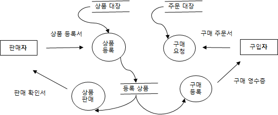
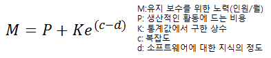

소프트웨어공학
---

나름 2년 전에 열심히 공부한 분야. 물론 분야는 더 좁지만. 조금 풀어보고 느낀점은, 문제가 좀 쉽다. 공부는 필요한 부분만 하도록 하자.

---

### 소프트웨어
컴퓨터 소프트웨어  
컴퓨터 하드웨어에서 목적하는 작업을 수행할 수 있게 만들어진 것.

컴퓨터 시스템  
* 입력
* 처리
* 출력
* 제어 : 입력=>처리=>출력 과정이 올바르게 진행되는지 감독
* 피드백 : 출력 결과가 예정 목표에 도달하지 못할 때 반복 처리

소프트웨어 위기의 원인  
* 프로젝트 개발 일정과 예산 측정이 어렵다.
* 유지보수 비용 증가
* 소프트웨어 개발 적체
* 규모 증가와 복잡도에 따른 개발 비용 증가
* 프로젝트 관리 기술의 부재
* 개발 기술에 대한 훈련 부족

소프트웨어 공학이란  
소프트웨어 개발을 위한 방법론과 도구 및 관리 기법.

소프트웨어 공학의 기본 원칙  
* 현대적인 프로그래밍 기술 적용
* 지속적인 검증 시행
* 결과에 관한 명확한 기록 유지

---

### 소프트웨어 생명 주기 (Life Cycle)
개발 방법론에 따라 소프트웨어 개발 공정을 단계별로 나눈 것. 비용 산정과 개발 계획을 수립할 수 있는 기본 골격. 효과 : 용어의 표준화, 문서화가 충실한 프로젝트 관리.

소프트웨어 생명 주기 모델  
* 프로토타입(Prototype) 모델  
사용자의 요구사항을 파악하기 위해 견본을 만들어 예측하는 모델. 부경 타이쿤을 생각해보자. 개발 단계 안에서 유지보수가 이루어진다.  
**요구 수집 => 빠른 설계 => 프로토타입 구축 => 고객 평가 => 프로토타입 조정 => 구현**
* 폭포수(Waterfall) 모델  
각 단계별로 철저한 검토와 승인 과정을 거쳐 확실히 매듭짓고 다음 단계로 진행하는 모델. 고전적인 모델로 선형 순차적 모델이라고 한다. 단계별 정의가 분명하고 단계별로 산출물이 명확하다. 동아리에서 프로젝트 진행한다 하면 대게 이런 식으로 진행된다. 의도했다기 보단 잘 모르다보니까...  
**계획 => 분석 => 설계 => 구현 => 시험 => 운용 => 유지보수**
* 나선형(Spiral) 모델  
여러 번의 개발 과정을 거쳐 점진적으로 프로젝트를 완성시켜가는 모델. 대규모 시스템 소프트웨어 개발에 적합하다. 위험 분석과정으로 점진적으로 위험 요소를 발견하고 제거해 나갈 수 있다. 대신 위험 분석과정에 의존도가 높다.  
**계획 => 위험 분석 => 개발 => 고객 평가**

---

### 소프트웨어 프로젝트
이해관계자의 요구 사항을 만족하는 시스템을 개발하는 전반적인 활동.

소프트웨어 프로젝트의 3대 요소  
* 요구사향 : 개발해야 할 문제
* 개발자 : 프로젝트 수행에 참여하는 사람
* 개발공정 : 계획, 구조 설계 및 구현 과정

소프트웨어 프로젝트 관리 사이클  
1. 계획 수립
2. 가동 (프로젝트 조직 및 팀원 선발)
3. 통제 및 수행 (요구 사항의 변경을 반영, 수행 결과 확인)
4. 종료 (결과물 점검 후 종료)

소프트웨어 프로젝트 관리를 위한 3대 요소 (3P)  
* 사람 (People) : 인적 자원
* 문제 (Problem) : 문제 인식
* 프로세스 (Process) : 작업 계획

---

### 프로젝트 비용 산정
비용 산정을 위해서는 프로젝트의 특징, 투자 자원, 생산성을 생각해야한다. 비용 산정 방식에는 하향식과 상향식이 있다.

하향식 비용 산정 방식  
경험이 많은 전문가에게 비용 산정을 의뢰하거나 여러 전문가와 조정자를 통해 산정하는 방식(델파이 기법).

상향식 비용 산정 방식  
세부적인 요구 사항과 기능에 따라 필요한 비용을 계산하는 방식.  
Lines Of Code, Man*Month 등 수학적 방법으로 비용을 산정한다.
* COCOMO 모형  
코드 수로 프로젝트의 규모를 정하고 계산식에 사용할 가중치를 결정한다. Organic => Semi-detached => Embedded 순으로 규모가 커진다.
예상 비용 = (낙관정도 + 4*기대정도 + 비관정도)/6
* Putnam 모형  
소프트웨어 개발 주기의 각 단계별로 요구할 인력의 분포를 가정하는 모형이다.
* FP(Function Point) 모형  
요구 기능을 증가시키는 인자별로 가중치를 부여해 기능의 점수를 계산해서 비용을 산정하는 방식.  
FP(Function Point) = 전체 기능 점수 * [0.65 + (0.1 * 총 영향 정도)]

---

### 프로젝트 설계

설계 모형  
* 프로시저 절차 설계 : 기능의 수행 흐름을 절차식으로 기술
* 인터페이스 설계 : 상호 작용에 관한 약속을 기술
* 아키텍쳐 설계 : 소프트웨어를 구성하는 요소 간의 관계를 기술
* 아키텍쳐 설계 : 소프트웨어를 구성하는 요소 간의 관계를 기술
* 데이터 설계 : 요구 분석 단계 결과로 소프트웨어 구현에 필요한 데이터 구조를 기술

하향식 설계 방법  
전체적인 설계 -> 자세한 설계

상향식 설계 방법  
자세한 설계 -> 전체적인 설계

추상화  
세부적인 사항을 설계하기 전에 전체적이고 포괄적인 개념을 설계하는 과정  
* 기능 추상화 : Input -> Output 과정을 추상화
* 제어 추상화 : 제어의 매커니즘을 배제하고 궁극적으로 원하는 효과를 표현
* 자료 추상화 : 자료와 자료에 적용할 수 있는 기능을 함께 정의해 자료 개체를 구성

---

### Data Flow Diagram / Data Dictionary

자료 흐름도  
자료의 흐름과 처리 과정을 도형 중심으로 기술

* 프로세스 : 원
* 자료 흐름 : 화살표
* 자료 저장소 : 직선 두개
* 터미널 : 사각형

자료 사전  
자료 = *주속* [ 선택 자료1 | 선택 자료2 | ] + 구성 자료 + { 반복 구성 자료 }n + (옵션)  
* = : 자료의 정의
* [ ] : 자료의 선택
* | : or
* \+ : and
* { } : 자료의 반복 (아래 첨자에서 위 첨자 까지 반복)
* ( ) : 생략가능
* \* * : 주석

---

### 유지보수
개발된 소프트웨어의 품질을 항상 최상의 상태로 유지하기 위한 것.

* 수정(Corrective) 보수 - 검사단계에서 발견하지 못한 잠재적인 오류를 찾아 수정하는 활동
* 적응(Adaptive) 보수 - 환경의 변화를 기존의 소프트웨어에 반영하기 위해 수행하는 활동
* 완전화(Perfective) 보수 - 본래 기능에 새로운 기능을 추가하거나 성능을 개선하기 위해 소프트웨어를 확장시키는 활동, 유지보수 중 가장 큰 업무 및 비용 차지
* 예방(Preventive) 보수 - 장래의 유지보수성 또는 신뢰성을 개선하거나 오류발생에 대비해 미리 예방 수단을 강구해 두는 활동(=> 소프트웨어 재공학)

유지보수 비용 산정 공식  

---

### 소프트웨어 품질
품질 보증  
어떤 항목이나 제품이 설정된 기술적 요구 사항과 일치하는지를 적절하게 확인하는데 필요한 체계적이고 계획적인 유형의 활동.

품질 표준 구분  
* 신뢰성 (Reliability) : 요구된 기능을 얼마나 오류없이 정확하게 실행할 수 있는가
* 이식성 (Portability) : 다양한 하드웨어에서 운용 가능하도록 쉽게 수정할 수 있는가
* 정확성 (Correctness) : 사용자가 요구한 기능을 얼마나 충족시키는가
* 효율성 (Efficiency) : 얼마나 많은 자원이 필요한가
* 상호 운용성 (Interoperability) : 다른 소프트웨어와 정보를 쉽게 교환할 수 있는가
* 재사용성 (Reusability) : 전체나 일부 소프트웨어가 다른 응용 목적으로 사용 가능한가
* 사용 용이성 (Usability) : 사용법을 쉽게 학습 가능한가

신뢰도 측정  
* MTBF (평균 고장 간격, Mean Time Between Failure)
* MTTF (평균 가동 시간, Mean Time To Failure)
* MTTR (평균 수리 시간, Mean Time to Repair)

MTBF = MTTF + MTTR  
이용 가능성 = MTTF/(MTTF+MTTR) * 100%

---

### 소프트웨어 재공학
기존에 있던 소프트웨어를 파기하지 않고 새로운 기능을 추가해 예방(Preventive) 유지보수 측면에서 문제를 해결하는 것.

분석 (Analysis)  
기존 소프트웨어의 명세서를 확인하고 소프트웨어의 동작을 이해하고 재공학 대상을 선정하는 활동.

재구성 (Restructuring)  
소프트웨어 기능을 변경하지 않고 소프트웨어 형태에 맞게 수정하는 활동. 상대적으로 추상적 수준인 표현 중 하나를 다른 형태를 변경.

역공학 (Reverse Engineering)  
기존 소프트웨어를 분석하여 소프트웨어 개발과 데이터 처리 과정을 분석하고 설계 정보를 재발견하거나 다시 만드는 작업.

이식 (Migration)  
기존 소프트웨어를 다른 운영체제나 하드웨어 환경에서 사용할 수 있게 변환하는 작업.

---

### 응집도와 결합도

응집도 (Cohesion)  
한 모듈 내의 함수적 강도, 높을수록 좋다.  
우-리-시-절-교-차-기
* 우연적(Coincidental) : 관계없는 요소가 모여 모듈 구성
* 논리적(Logical) : 모듈 요소가 논리적으로 관계가 있음, 파라미터에 따라 모듈의 기능이 달라짐(ex. 입력 출력은 비슷하니까 서로 묶어서 입출력 모듈)
* 시간적(Temporal) : 비슷한 시간대에 처리되는 기능을 모듈로 구성
* 절차적(Procedural) : 순서가 정해진 몇 개의 구성 요소를 하나의 모듈로 구성, **어떤 구성 요소의 출력이 다음 구성 요소의 입력으로 사용되지 않고, 그저 순서에 따라 수행될 뿐**
* 교환적(Communication) : 공동 입력 또는 공동 출력을 가지는 구성 요소를 모듈로 구성, 요소간 순서는 중요하지 않음
* 순차적(Sequential) : 순서가 정해져 있는데, **한 요소의 출력을 다른 요소의 입력으로 사용**
* 기능적(Functional) : 모듈 내 요소가 기능 단 하나만을 위한 요소들인 경우

결합도 (Coupling)  
두 모듈 간의 독립성, 낮을수록 좋다.  
데-스-제-공-용
* 내용(Content) : 모듈 간에 인터페이스를 사용하지 않고 직접 왕래하는 경우(ex. goto문으로 다른 모듈을 침범)
* 공통(Common) : 두 모듈이 공통 변수를 같이 사용하는 경우(ex. 두 변수가 한 전역변수를 사용)
* 제어(Control) : 한 모듈이 다른 모듈을 제어하는 경우(ex. 한 모듈이 제어 플래그로 다른 모듈의 행동을 결정)
* 스탬프(Stamp) : Call by Reference, 모듈 간의 인터페이스로 데이터 타입이 전달되는 경우
* 데이터(Data) : Call by Value, 모듈 간 데이터만 전송되는 경우

---

### Test

검사 순서  
단위(코드) 검사 -> 통합(설계) 검사 -> 검증(요구사항) 검사 -> 시스템 검사  

화이트 박스  
모듈 안의 작동을 직접 관찰하는 방식으로, 원시 코드의 모든 문장을 한 번 이상 수행한다. 프로그램의 제어 구조에 따라 선택, 반복 등의 부분들을 수행해 논리적 경로를 제어한다.  
기본 경로 테스트, 조건 테스트, 데이터 흐름 테스트, 반복 테스트를 수행한다.

블랙 박스  
제품이 수행할 특정 기능을 알기 위해서 각 기능이 완전히 작동하는 것을 입증하는 방식이다. 성능 오류, 부정확한 기능, 인터페이스 오류를 발견할 수 있다.  
동치 분할 검사, 경계값 분석, 원인 효과 그래프 검사, 오류 예측 검사, 비교 검사를 수행한다.

---

### 럼바우의 객체 지향 분석
소프트웨어 구성 요소를 그래픽 표기로 모델링하는 기법으로 일명 OMT(Object Modeling Technique)  

* Object 모델링 : 정보 모델링으로 필요한 Object를 찾고 Object 사이의 관계를 정하는 모델링
* Dynamic 모델링 : 상태도를 이용하여 제어 흐름을 모델링
* Functional 모델링 : 자료 흐름도를 이용하여 다수의 프로세스 사이의 자료 흐름을 중심으로 처리 과정을 표현한 모델링

---

### 기타등등
외계인 코드  
아주 오래돼 유지보수 작업이 어려운 프로그램.

CASE (Computer-Aided Software Engineering)  
소프트웨어 개발 과정에서 사용되는 요구 분석, 설계, 구현, 검사 및 디버깅 과정을 컴퓨터와 전용 소프트웨어 도구로 자동화하는 작업을 의미.  
장점으로는, 소프트웨어 개발 기간 단축 및 비용 절감, 유지보수 용이, 품질, 생산성, 재사용성 향상, 개발 주기의 표준화, 개발 기법의 실용화, 문서화 용이 등.

요구사항 분석 작업이 어려운 이유  
* 클라이언트와 개발자간의 배경지식차이
* 사용자의 요구는 예외가 많아 열거와 구조화가 어려움
* 요구사항의 모호함, 불완전함
* 시스템 자체의 복잡함

브룩스의 법칙  
프로젝트 진행중에 새로운 인력을 투입할 경우 작업 적응 기간과 부작용으로 인해 일정을 더욱 지연시키고, 프로젝트에 혼란을 가져오게 된다.

Fan-in : 어떤 모듈을 제어하는 상위 모듈 수, 한 노드로 들어오는 화살표 수
Fan-out : 한 노드로부터 나가는 화살표 수

Coad-Yourdon 방법  
E-R 다이어그램을 사용해 객체의 행위를 모델링하는 객체지향 분석 방법론

Booch 방법  
미시적 개발 프로세스와 거시적 개발 프로세스를 모두 사용하는 분석 방법

Jacobson 방법  
Use Case를 강조하여 사용하는 분석 방법

Wirfs-Brock 방법  
분석과 설계 간의 구분이 없고, 고객 명세서를 평가해 설계 작업까지 연속적으로 수행하는 기법

---