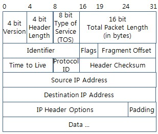
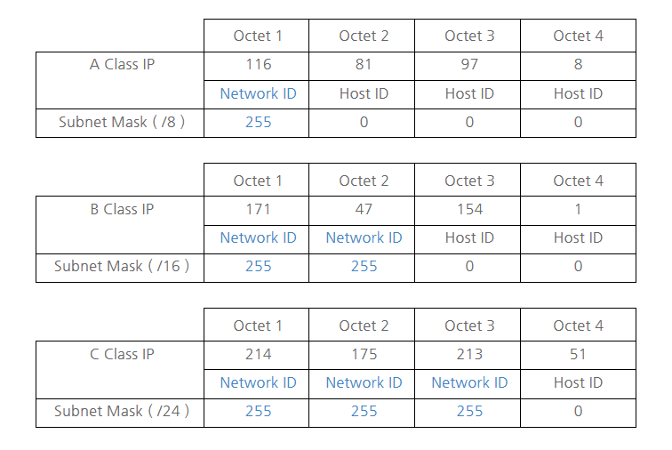

데이터통신
---

마지막 과목. 마냥 쉬워보이진 않는다.  
[여기서 주로 찾아보자](https://androidtest.tistory.com/60)

---

### 데이터 통신
광대역 데이터 전송 회선 구축 => 데이터 전용 교환망 구축 => 디지털 전용 회선 구축 => 종합 정보 통신망 구축

통신의 3요소  
* 전송자 (Source)
* 수신자 (Destination)
* 전송 매체 (Transmission Media)

---

### 오류

발생 원인  
* 감쇠 : 전송 신호가 전송 매체를 통과하는 과정에서 거리에 따라 약해지는 현상
* 지연 왜곡 : 하나의 전송 매체를 통해 여러 신호를 전달 했을 때 주파수에 따라 그 속도가 달라 생기는 오류
* 간섭 : 서로 다른 주파수들이 하나의 전송 매체를 공유할 때 주파수 간의 합이나 차로 인해 새로운 주파수가 생성되는 잡음
* 혼선 : 전잦기적 상호 유도 작용에 의해 생기는 잡음
* 충격성 잡음
* 시스템적 왜곡

오류 제어 방식  
* 순방향 오류 수정 (Forward Error Correction)  
재전송 요구 없이 수신 측에서 스스로 오류 검출과 수정을 하는 방식이다. 검출 및 수정을 위해 비트들이 추가로 전송되어야 하기 때문에 효율은 별로. 해밍코드, 상승코드 등.
* 역방향 오류 수정 (Bacward Error Correction)  
오류가 발생하면 다시 보내세요 하는 방식. ARQ에 의해 오류제어가 이루어진다.

Automatic Repeat reQuest  
말 그대로 자동 반복 요청. 오류 발생 통보, 블록 재전송하는 모든 절차를 의미한다.

* 정지-대기 ARQ  
한 개의 블록을 전송한 후 수신측으로부터 응답을 기다리는 방식. 간단한데 효율이 떨어진다.
* 연속 ARQ  
연속적으로 데이터 블록을 보내는 방식.
    - Go-Back-N : 오류가 발생한 블록 이후의 모든 블록을 재전송한다.
    - 선택적 재전송 : 오류가 발생한 블록만을 재전송하는 방식이다. 수신측에서 원래 순서대로 조립해야 하기 때문에 비용이 더 든다.
* 적응적 ARQ  
데이터 블록의 길이를 채널의 상태에 따라 동적으로 변경하는 방식. 효율이 좋지만 너무 비싸서 안씀.

---

### 오류 검출 방식
패리티 검사  
전송 비트에 1비트인 패리티 비트를 추가해 오류를 검출한다.
* 간단하다.
* 2개 비트에 오류가 동시에 발생하면 검출이 불가능하다.
* 오류 검출이 가능하긴 한데 수정은 못한다.

코드에서 1인 비트의 수가 홀수가 되도록 0이나 1을 추가하는 **홀수 패리티**, 짝수가 되도록 0이나 1을 추가하는 **짝수 패리티**로 나뉜다.

순환 중복 검사(CRC)  
다항식 코드를 사용해 오류를 검출하는 방식이다.
* 집단 오류를 검출할 수 있다.
* 검출률이 높아 가장 많이 사용된다.

해밍 코드  
2n에 해당하는 순서의 비트를 패리티 비트로 쓰는 코드이다. 1비트 오류를 교정할 수 있고, 2비트 오류를 검사할 수 있다.  

|Parity|1|2|3|4|5|6|7|
|:-:|:-:|:-:|:-:|:-:|:-:|:-:|:-:|:-:|:-:|
|1|□|■|□|■|□|■|□|
|2|□|■|■|□|□|■|■|
|4|□|□|□|■|■|■|■|
|...||||||||

예를 들어, 짝수 패리티 비트의 해밍 코드 0011011을 받았을 때, 오류를 수정하는 법은  
1에서 1, 3, 5, 7을 선택해 0101, 짝수이므로 '0'  
2에서 2, 3, 6, 7을 선택해 0111, 홀수이므로 '1'
4에서 4, 5, 6, 7을 선택해 1011, 홀수이므로 '1'  
얻어낸 비트는 110이고, 10진법으로 바꾸면 6이다. 따라서 0011011의 오류 위치는 6번째 자리인 '1' 이다. 답은 0011001. 어렵다.

---

### 디지털 변조
모뎀을 이용하여 디지털 데이터를 아날로그 신호로 변조하는 방식

진폭 편이 변조 (Amplitude Shift Keying)  
2진수 0과 1을 서로 다린 진폭의 신호로 변조한다. 구조가 간단하고 가격이 저렴하다. 신호 변동과 잡음에 약해 데이터 전송용으로 거의 사용 안한다고함.

주파수 편이 변조 (Frequency Shift Keying)  
2진수 0과 1을 서로 다른 주파수로 변조한다. 1200bps 이하의 저속도 비동기식 모뎀에 사용한다. 구조가 간단하고 신호 변동과 잡음에도 강하다.

위상 편이 변조 (Phase Shift Keying)  
2진수 0과 1을 서로 다른 위상을 갖는 신호로 변조한다. 중, 고속의 동기식 모뎀에 사용한다. 2위상, 4위상, 8위상 편이 변조가 있다.

직교 진폭 변조 (Quadrature Amplitude Modulation)  
반송파의 진폭과 위상을 상호 변환하여 신호를 얻는 변조 방식이다. 고속 전송이 가능하고, 9600bps 모뎀의 표준 방식으로 권고된다.  

ex. QAM에서 4위상, 2진폭, 2400baud인 경우 bps?  
4위상 = 22 = 2비트  
2진폭 = 21 = 1비트  
따라서 한 번에 3비트씩 전송 가능  
2400 * 3 = 7200

---

### OSI 7 계층

* 물리 계층 : 통신에 사용하는 물리적인 전송 매체
* 데이터 링크 계층 : 프레임 데이터를 전송, 데이터 에러 검출 및 회복과 흐름 제어
* 네트워크 계층 : 통신 경로 배정, 패킷 전달, 주소 설정
* 전송 계층 : End to End 간 데이터 전송
* 세션 계층 : 대화 제어를 담당, 전송 진행의 동기점 제공
* 표현 계층 : 암호화, 압축, 문맥 관리
* 응용 계층 : 최종 사용자에게 통신 서비스 제공

물리 -> 데이터 링크 -> 네트워크 -> 전송 -> 세션 -> 표현 -> 응용

데이터 전송 단위  
1. Bit
2. Frame
3. Packet
4. Segment(TCP) / Datagram(UDP)
5. Message
6. Message
7. Message

---

### TCP/IP 4계층

* 네트워크 엑세스 계층  
실제 데이터를 송, 수신하는 역할  
이더넷, IEEE 802, HDLC, X.25, RS-232C, PPP 등
* 인터넷 계층  
데이터 전송을 위한 주소 지정, 경로 설정 제공  
IP, ICMP, IGMP, ARP, RARP 등
* 전송 계층  
호스트들 간의 신뢰성 있는 통신 제공  
TCP, UDP, RTP, RTCP 등
* 응용 계층  
응용 프로그램 간의 데이터 송, 수신 제공  
텔넷, FTP, SMTP, SNMP, HTTP, DNS, WAP 등

---

### 통신 프로토콜(Protocol)
통신에 사용하는 기기들 사이에 메시지를 주고 받기 위해 표준화 한 **통신 규약**.

TCP - 전송 계층  
스트림 전송 기능을 제공한다. FTP, SMTP, 텔넷, DNS, HTTP 등의 응용 계층 서비스 들이 사용한다.

UDP - 전송 계층  
연결을 설정하지 않는 비연결형 서비스를 제공한다. TCP에 비해 단순한 헤더 구조를 가지고 오버헤드가 적다. 신뢰성보다 속도가 중요하다면 UDP.

IP - 네트워크 계층  

데이터그램을 기반으로 하는 비연결형 서비스를 제공한다. IP 헤더의 길이는 20~60 바이트로, 패킷의 분해/조립, 주소 지정, 경로 선택 기능을 제공한다.

ICMP  
IP 프로토콜을 보완하기 위해 설계되었으며, 오류 보고와 오류 수정이 가능하다. 헤더는 8 바이트.

ARP  
IP 주소를 MAC 주소로 변환하는 프로토콜이다. (논리적 -> 물리적)

RARP  
ARP의 반대로, MAC 주소를 IP 주소로 변환하는 프로토콜이다. (물리적 -> 논리적)

RTCP  
실시간 전송 프로토콜이 안정되게 기능을 유지하도록 데이터 전송을 모니터링하고 최소한의 제어와 인증 기능을 제공한다.

---

### IP 주소  

클래스  
* A : 국가나 대형 통신망
* B : 중대형 통신망
* C : 소규모 통신망
* D : 멀티캐스트 용
* E : 실험용, 공용되지 않음

서브넷 마스크  

255.255.255.0, 넷 마스크를 이용해 네트워크를 나누는 것. IP 주소 체계의 Network ID와 Host ID를 넷 마스크를 통해 변경해 네트워크 영역을 분리시키는 개념.

서브넷팅의 특징  
2진수로 표현했을 때 Network ID 부분은 1이 연속적으로, Host ID 부분은 0이 연속적으로 있어야 한다.  
ex.  
255.255.255.0 = 11111111.11111111.11111111.00000000  
255.255.255.128 = 11111111.11111111.11111111.10000000

서브넷팅 계산 방법  
Host ID를 Network ID로 변화하기 위해 한 Bit씩 가져올 때 마다 **네트워크 크기는 2배로 증가, 호스트 수는 2로 나누어짐.**

ex. 194.139.10.123/26  
서브넷 마스크가 26비트 => 11111111.11111111.11111111.11000000 => 255.255.255.192 => 호스트에 할당 가능한 IP 범위 : [0~63], [64~127], [128~191], [192~255] => 네트워크 : [194.139.10.0], [194.139.10.64], [194.139.10.128], [194.139.10.192] (총 4개)  
따라서 194.139.10.123이 속한 네트워크는 194.168.10.64/26에 속하게 되며, 서브넷팅 된 3개의 다른 네트워크와는 라우터를 통해서만 통신할 수 있다.

---

### 다중화 기법

다중화기 (Multiplexer)  
하나의 통신 회선에 여러 개의 단말기가 동시에 접속하여 사용할 수 있도록 하는 장치.

주파수 분할 다중화방식 (FDM)  
하나의 회선을 다수의 주파수 대역으로 분할하여 다중화한다. 통신 회선의 유효 대역폭이 큰 경우에 적합. 모뎀이 필요없고, 구조가 쉽다. 가드 밴드로 인접 채널의 간섭을 막는다.

시분할 다중화방식 (TDM)  
하나의 회선을 다수의 짧은 시간 간격으로 분할하여 다중화한다. 디지털 회선에 주로 사용하며, 다중화기 내부 속도와 단말장치 속도 차이를 보완해주는 버퍼가 필요하다.
* 동기식 시분할 다중화방식 (STDM)  
모든 단말장치에 균등한 시간 폭을 제공한다. 동기 비트가 추가로 필요하다. (통신 회선의 데이터 전송률) > (전송 디지털 신호의 데이터 전송률) 일 때 사용한다.  
전송할게 없어도 시간폭이 제공되서 비효율적이다.
* 비동기식 시분할 다중화방식 (ATDM)  
동기식과 달리 동적으로 시간 폭을 제공하는 방식이다. 전송 효율이 좋고, 동기식 보다 많은 단말기들이 전송 매체에 접속할 수 있다.  
대신 데이터 전송량이 많아질 경우 전송 지연이 발생할 수도 있고, 가격이 좀 비싸고, 접속장치들의 데이터 전송률을 100% 활용하지는 못한다고 한다.

---

### HDLC (High-level Data Link Control)

HDLC가 뭔데에에에에에  
Bit 위주의 프로토콜로, 각 프레임에 데이터 흐름을 제어하고 오류를 검출할 수 있는 비트열을 삽입하여 전송한다.
* 정보(I) 프레임 : 사용자 데이터 전달. 제어부 0으로 시작.
* 감독(S) 프레임 : 오류제어와 흐름제어. 제어부 10으로 시작.
* 비번호(U) 프레임 : 링크설정과 오류회복. 제어부 11로 시작.

프레임 구조  
플래그(8Bit) 주소부(8Bit 확장 가능) 제어부(8Bit) 정보부(임의Bit) FCS(16/32Bit) 플래그(8Bit)  
플래그 : 프레임의 시작과 끝. (01111110)  
주소부 : 송수신국의 분별을 위해 사용. 방송용은 11111111, 시험용은 00000000.  
제어부 : 프레임 종류 식별. 제어부의 첫 번째, 두 번째 비트를 사용해 구분.

피기백킹 (Piggybacking)  
수신측에서 별도의 확인응답(ACK)를 보내지 않고 상대편으로 향하는 데이터 프레임에 확인 응답을 포함시켜 전송하는 것. 따라서 상대편으로 향하는 데이터 전문으로 응답한다.

동작모드  
* NRM(Normal Resonse Mode) : 반이중/점대점or멀티포인트/불균형 링크
* ARM(Asynchronous Response Mode) : 전이중/점대점/불균형 링크
* ABM(Asynchronous Balanced Mode) : 전이중/점대점/균형 링크

---

### 용어 정리

통신 용량 = 대역폭 X log(1 + 신호/잡음)

IEEE 802  
이걸 다 외우라고? 양심 어디?  
* .2 : 논리 링크 제어 계층
* .3 : CSMA/CD
* .4 : 토큰 버스
* .5 : 토큰 링
* .6 : LAN
* .11 : 무선 LAN

IP 주소 체계
IPv4 - Uni, Multi, Broad  
IPv6 - Uni, Multi, Any

PSK에서 반송파간의 위상차  
= 2π/진수  
ex.  
2 위상(1 비트, 2 진수)인 경우 0은 0º, 1은 180º로 표현 (360º/2)  

X.25 3계층  
* 물리 계층 -- 물리 계층 (OSI), X.21 사용
* 프레임(데이터 링크) 계층 -- 데이터 링크 계층 (OSI), 전송 제어를 위해 HDLC 프로토콜의 변형인 LAPB 사용
* 패킷 계층 -- 네트워크 계층 (OSI)

ALOHA  
최초의 라디오 패킷 통신방식을 적용한 컴퓨터 네트워크 시스템. 이런것 까지 물으니까 시험 개편 이야기가 나오지. 알로하 이름 자체는 외우기 쉽다. 공돌이 네이밍 센스 덕분에.

NRZ(None Return to Zero)  
* NRZ-L(Level) : 1은 Low level, 0은 High level 부여. 신호에 1이 많은 경우 유리.
* NRZ-I(Inverted) : 0 또는 1이 연속으로 나타날 때 수신측 비트 동기의 어려움을 피하고자 한 방식이다. 0인 경우 이전 레벨을 유지하고 1인 경우 반전시킨다.
* NRZ-M(Mark) : 0인 경우 이전 레벨 유지, 1인 경우 반전. I와 유사.
* NRZ-S(Space) : 0인 경우 반전, 1인 경우 이전 레벨 유지.

해밍 거리  
같은 비트 수를 갖는 2진 부호 사이에 대응되는 비트값이 일치하지 않는 개수. 일반적으로 해밍 거리 d가 d ≥ 2a + 1 이면 a개의 오류를 정정할 수 있다.  
**d ≥ 2a + 1** (d : 해밍 거리, a : 오류의 수)

---